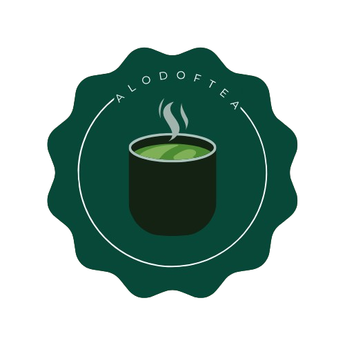

  

## 🍵 aLODofTEA

> A digital humanities project exploring the beauty, rituals, and philosophy of the Japanese tea ceremony through **Linked Open Data**.

---

## 👩‍💻 Team Members

- [**Fahmida Islam**](https://github.com/Fahmyrose)
- [**Shiho Nakamura**](https://github.com/shiho1000)

---

## 🫖 Project Description

**aLODofTEA** is a semantic web project that explores the **Japanese tea ceremony** (*Sadō*) as a cultural practice, combining **text encoding (TEI/XML)** and **Linked Open Data (LOD)** technologies.

Through this project, we:

- Created a TEI-compliant digital edition of chapters from <i>The Book of Tea</i> by Okakura Kakuzō
- Identified and linked cultural heritage objects related to our domain
- Modeled the information in RDF using real museum metadata
- Visualized the data in a <a href="https://projectlod.github.io/aLODofTea/">website</a>

All work was conducted with special attention to aesthetics and cultural respect, reflecting the spirit of *wabi-sabi* and the harmony found in tea rituals 🍃

---

## 🎓 Academic Context

Developed as part of the course **Information Science and Cultural Heritage** (2024/2025), taught by [Prof. Francesca Tomasi](https://www.unibo.it/sitoweb/francesca.tomasi) and [Prof. Marilena D’Aquino](https://www.unibo.it/sitoweb/marilena.daquino2) in the [**Digital Humanities and Digital Knowledge (DHDK)**](https://corsi.unibo.it/2cycle/DigitalHumanitiesKnowledge/index.html) master's program at the University of Bologna.

---

## 🌸 Highlights

- 🗻 **Cultural Focus**: Embracing Zen, Wabi-Sabi and symbolism of the tea ceremony  
- 🧾 **Textual Encoding**: TEI/XML edition with semantic markup of places and concepts  
- 🏺 **Cultural Objects**: 10 cultural heritage items from real museum collections  
- 🕸️ **LOD Integration**: RDF modeling, Theoretical and Conceptual models  
- 🌐 **Web Presentation**: A thematic website showcasing our research

---

## 📜 License

This project is shared under the MIT License.  
Please cite appropriately and respect cultural context when reusing content.

---

## ☕ Final Notes

Thank you for joining us in this quiet, mindful journey through heritage, poetry and philosophy — all contained in a cup of tea 🍵.

